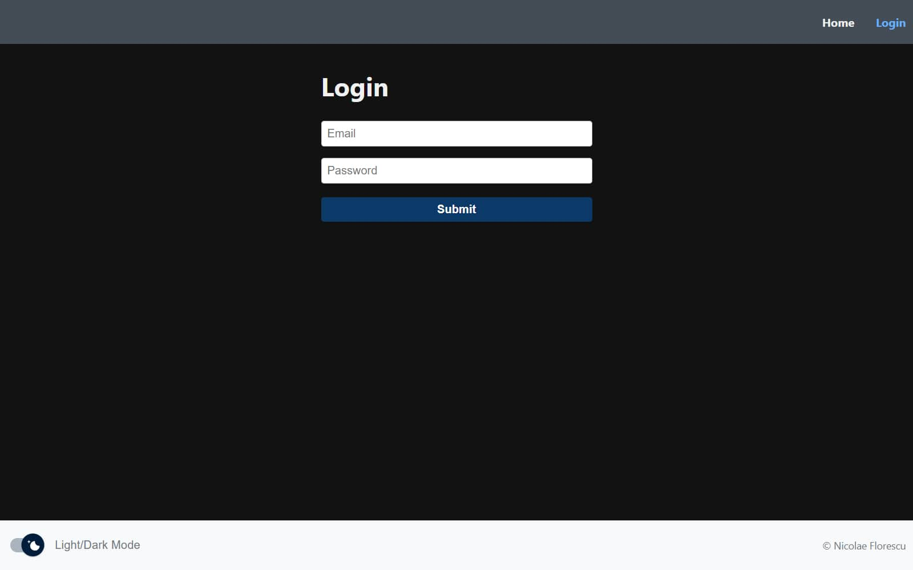
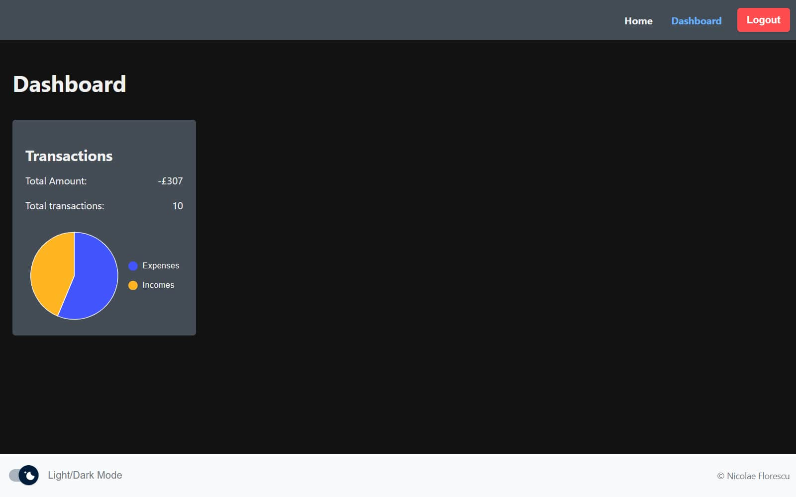
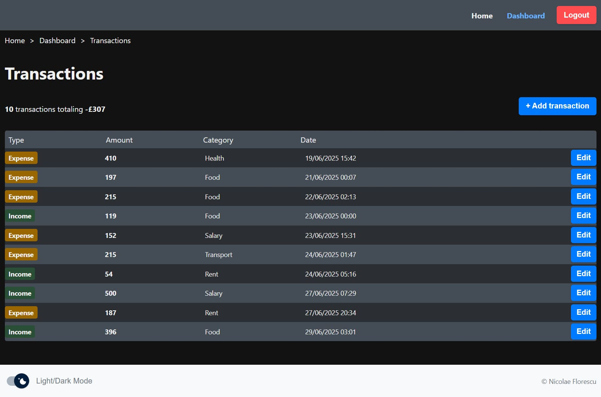
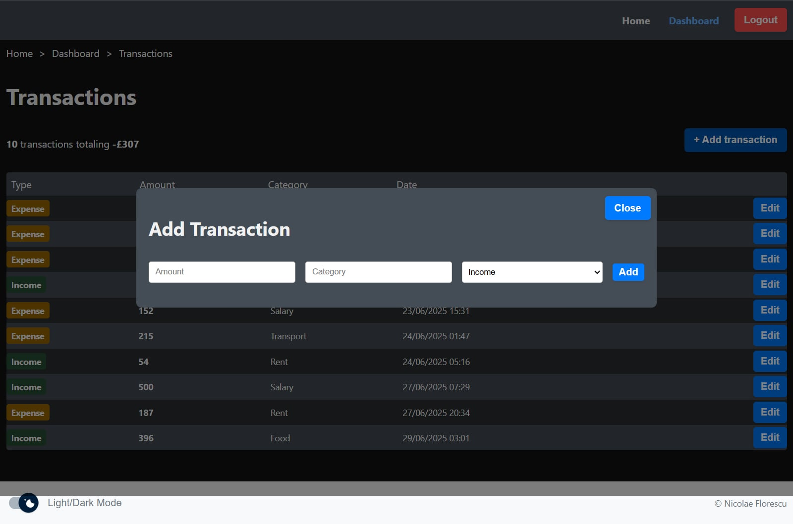
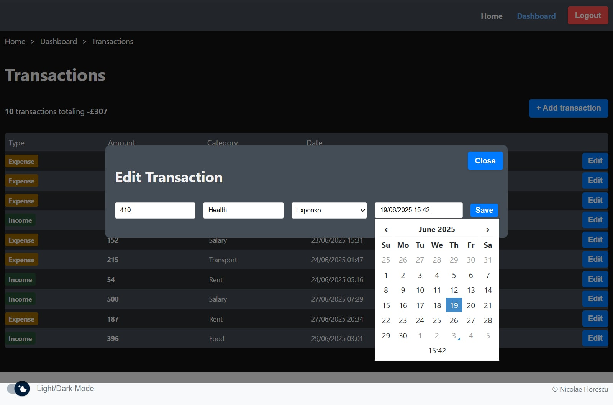

# This projects has 2 sides
- dashboard-frontend - built with React 19, TypeScript, and Vite
- dashboard-backend - powered by Express.js and connected to a MongoDB database using Mongoose

> **Note:** For both parts you will find a README.md inside each directory with steps on how to run them.
- <a href="https://github.com/nicolasflorth/dashboard-app/blob/main/dashboard-frontend/README.md" title="Frontend readme" target="_blank">Frontend readme</a>
- <a href="https://github.com/nicolasflorth/dashboard-app/blob/main/dashboard-backend/README.md" title="Backend readme" target="_blank">Backend readme</a>

> **Note:** Database is seeded with 10 transaction and one user on the first backend run

> **Important:** Login details of the created user: test@test.com / emilyspass

## The Frontend is using
- React 19
- React router
- Redux toolkit
- React datetime
- Tanstack react query
- Zod
- MUI components
- Axios
- JWT
- Vitest

# Recomended environment
- node v20.19.3 
- npm v10.8.2

# Preview
<table>
  <tr>
    <td>
      
    </td>
    <td>
      
    </td>
    <td>
      
    </td>
  </tr>
  <tr>
    <td>
      
    </td>
    <td>
      
    </td>
  </tr>
</table>
